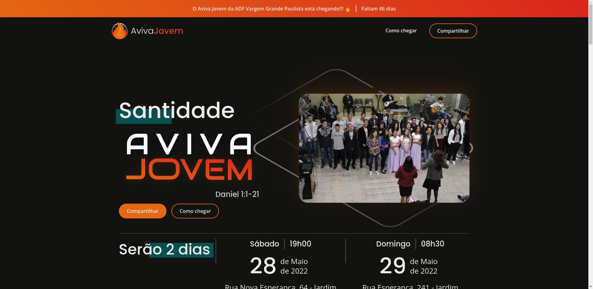

<h1 align="center">
    
    <br>
</h1>

<h4 align="center">
  <p>Site Aviva Jovem.</p>

  <p>Neste projeto fiz uma landing page para divulgar o projeto regional da minha igreja que irá voltar.</p>
</h4>

<p align="center">
  <a href="https://andrejr.dev">
    
  </a>
</p>

<p align="center">
  <a href="#rocket-tecnologias">Tecnologias</a>&nbsp;&nbsp;&nbsp;|&nbsp;&nbsp;&nbsp;
  <a href="#information_source-como-instalar">Como instalar</a>&nbsp;&nbsp;&nbsp;|&nbsp;&nbsp;&nbsp;
  <a href="#comandos">Comandos</a>&nbsp;&nbsp;&nbsp;
</p>

<p align="center">
  
</p>

## :rocket: Tecnologias

Este projeto foi desenvolvido com as seguintes tecnologias:

- [TypeScript](https://www.typescriptlang.org/)
- [NextJS](https://nextjs.org/)
- [Styled Components](https://styled-components.com/)
- [Eslint](https://eslint.org/)
- [Prettier](https://prettier.io/)
- [React Slick](https://react-slick.neostack.com/)
- [React Modal](https://github.com/reactjs/react-modal)

## :information_source: Como instalar

Para clonar e executar este aplicativo, você precisará do [Git](https://git-scm.com) instalado em seu computador. Da sua linha de comando:

```bash
# Clonar este repositório
$ git clone https://github.com/andrejr971/aviva2.0.git

# Navegue até o repositório
$ cd aviva2.0

#instale os pacotes
$ npm install

# Execute a aplicação em modo de desenvolvimento
$ npm run start

# A aplicação será aberta na porta:3000 - acesse http://localhost:300
```

## Comandos

- `dev`: runs your application on `localhost:3000`
- `build`: creates the production build version
- `start`: starts a simple server with the build production code
- `lint`: runs the linter in all components and pages

---

Feito by André Junior :wave: [portifólio](https://andrejr.dev)
